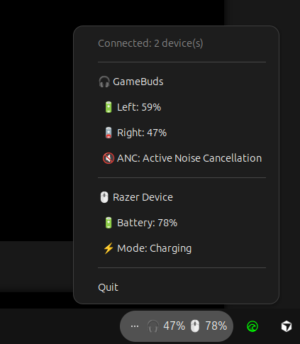

# goarctis

Linux System Tray Application written in Go for monitoring battery levels of wireless devices, including SteelSeries Arctis GameBuds and Razer devices (via OpenRazer Linux Driver).



## Features

### SteelSeries Arctis GameBuds

- Real-time battery monitoring for both earbuds
- ANC mode display (Active/Transparency/Off)
- Wear detection (In Case/Out/Wearing)
- System tray integration for easy access

### Razer Devices (via OpenRazer)

- Battery level monitoring for supported Razer devices
- Charging/Wireless mode detection
- Automatic reconnection handling for mode switches
- Works with any Razer device that supports battery reporting via OpenRazer

### Multi-Device Support

- Monitor multiple devices simultaneously
- Unified system tray display showing both device battery levels
- Automatic device discovery at startup

## Requirements

- Go 1.25 or later
- Linux with PulseAudio/PipeWire
- **For GameBuds:** SteelSeries Arctis GameBuds
- **For Razer devices:** OpenRazer daemon installed and running

## Installation

### 1. Clone the repository

```bash
git clone https://github.com/yourusername/goarctis.git
cd goarctis
```

### Commands

Run the Application:

```bash
make run
```

Build the binary:

```bash
make build
```

Run Tests:

```bash
make test
```

Check Version:

```bash
./bin/goarctis --version
```

## Releases

### Creating a Release

To create a new release:

1. **Create and push a git tag**:

   ```bash
   make release VERSION=v0.2.0
   ```

   This will:

   - Create an annotated git tag with the specified version
   - Push the tag to the remote repository
   - Trigger the GitHub Actions release workflow

2. **The release workflow will automatically**:
   - Build the binary with the version injected
   - Create a GitHub release with release notes
   - Upload the compiled binary as a release artifact

### Version Detection

The application automatically detects its version:

- **Release builds**: Version is injected at build time via `-ldflags`
- **Development builds**: Uses `git describe --tags --always --dirty` or defaults to "dev"
- **Manual override**: Set `VERSION` environment variable when building

The version is displayed:

- Via the `--version` command-line flag
- In the system tray tooltip

## Documentation

For more detailed documentation, see the [`docs/`](docs/) folder:

- **[Code Structure](docs/code_structure.md)**: Detailed explanation of the project structure, package organization, and design principles
- **[How It Works](docs/how_it_works.md)**: In-depth technical documentation on HID device communication, protocol parsing, and system tray integration

## Systemd Service Setup

To run goarctis as a systemd user service (automatically starts on login and runs in the background):

1. **Create the systemd service file** (if it doesn't exist):

```bash
mkdir -p ~/.config/systemd/user
cat > ~/.config/systemd/user/goarctis.service << EOF
[Unit]
Description=goarctis Battery Monitor
After=graphical-session.target

[Service]
Type=simple
ExecStart=/usr/local/bin/goarctis
Restart=on-failure
RestartSec=5

[Install]
WantedBy=default.target
EOF
```

2. **Build and install the binary**:

```bash
make build
sudo cp bin/goarctis /usr/local/bin/
sudo chmod +x /usr/local/bin/goarctis
```

3. **Enable and start the service**:

```bash
systemctl --user daemon-reload
systemctl --user enable goarctis.service
systemctl --user start goarctis.service
```

4. **Check service status**:

```bash
systemctl --user status goarctis.service
```

### Updating the Service

To update goarctis after making changes, use the provided script:

```bash
./scripts/update_systemd.sh
```

This script will:

- Stop the running service
- Build the new binary
- Install it to `/usr/local/bin/goarctis`
- Restart the service
- Show the service status

**Note**: The systemd setup has been tested on Ubuntu. For other Linux distributions, you may need to adjust paths or service configuration. Contributions for other distributions are welcome!
