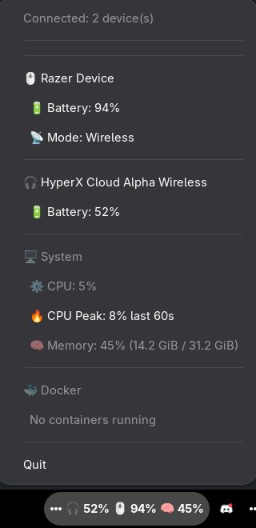

# goarctis


A Linux system tray application for monitoring wireless peripheral battery levels, Docker containers, and host CPU/memory utilization.

## What It Does

`goarctis` sits in your system tray and shows real-time battery status for SteelSeries GameBuds, HyperX Cloud Alpha Wireless headsets, and Razer devices, plus Docker container counts and host CPU/memory utilization. It uses HID for GameBuds and HyperX, OpenRazer's D-Bus API for Razer mice, and Linux procfs for system metrics.



## Why

Wireless peripherals don't expose battery levels in any standard Linux UI. Instead of checking dmesg, using device-specific GUIs, or polling D-Bus manually:

```bash
# Before
sudo cat /dev/hidraw3 | xxd   # hope you picked the right device
dbus-send --print-reply --dest=org.razer ... getBattery

# After
goarctis                       # battery levels in the system tray
goarctis --disable-gamebuds    # only monitor Razer + Docker
```

## Installation

**Download the latest release:**

```bash
curl -L https://github.com/jyablonski/goarctis/releases/latest/download/goarctis-linux-amd64 -o ~/.local/bin/goarctis
chmod +x ~/.local/bin/goarctis
```

Make sure `~/.local/bin` is in your `PATH`:

```bash
export PATH="$HOME/.local/bin:$PATH"
```

**Or build from source:**

```bash
git clone https://github.com/jyablonski/goarctis.git
cd goarctis
make build

# Binary is at bin/goarctis
sudo cp bin/goarctis /usr/local/bin/
```

### Build Dependencies

Building from source requires GTK3 and AppIndicator development libraries:

```bash
# Ubuntu/Debian
sudo apt install libayatana-appindicator3-dev libgtk-3-dev pkg-config

# Arch Linux
sudo pacman -S libayatana-appindicator gtk3 pkgconf
```

### Runtime Requirements

- Linux with PulseAudio/PipeWire
- **GameBuds:** SteelSeries Arctis GameBuds connected via USB dongle
- **HyperX Cloud Alpha Wireless:** connected via its 2.4 GHz USB dongle. The hidraw node is owned by `root:plugdev` — the user running goarctis must be in the `plugdev` group (`sudo usermod -aG plugdev $USER`, then log out and back in).
- **Razer devices:** [OpenRazer](https://openrazer.github.io/) daemon installed and running
- **Docker monitoring:** Docker CLI available in `PATH`
- **CPU/memory monitoring:** Linux `/proc` mounted normally

## Usage

| Flag | Description | Example |
| --- | --- | --- |
| `--version` | Print version and exit | `goarctis --version` |
| `--self-update` | Update to the latest release and restart the service | `goarctis --self-update` |
| `--disable-gamebuds` | Skip GameBuds monitoring | `goarctis --disable-gamebuds` |
| `--disable-razer` | Skip Razer device monitoring | `goarctis --disable-razer` |
| `--disable-hyperx` | Skip HyperX Cloud Alpha Wireless monitoring | `goarctis --disable-hyperx` |
| `--disable-system` | Skip CPU and memory monitoring | `goarctis --disable-system` |

Disabled sections are completely hidden from the tray dropdown menu.

Use `goarctis --help` for all available flags.

## Systemd Service

To run goarctis as a user service that starts on login:

```bash
mkdir -p ~/.config/systemd/user
cat > ~/.config/systemd/user/goarctis.service << EOF
[Unit]
Description=goarctis Battery Monitor
After=graphical-session.target

[Service]
Type=simple
ExecStart=/usr/local/bin/goarctis
Restart=on-failure
RestartSec=5

[Install]
WantedBy=default.target
EOF

systemctl --user daemon-reload
systemctl --user enable --now goarctis.service
```

To update, stop the service, replace the binary, and restart:

```bash
systemctl --user stop goarctis.service
# install new binary ...
systemctl --user start goarctis.service
```

Or use the provided script: `./scripts/update_systemd.sh`

## Updating

To update goarctis to the latest release:

```bash
goarctis --self-update
```

This checks the latest GitHub release, downloads the new binary, replaces the current one in place, and runs `systemctl --user restart goarctis.service` to pick up the change. If the version is already up to date it exits early.

Skipped automatically on dev builds (no version set via ldflags).

## Development

```bash
make build          # Build binary
make run            # Run the application
make test           # Run tests
make test-coverage  # Run tests with HTML coverage report
make build-test     # Build as goarctis-test (avoids conflicts with running instance)
make clean          # Remove build artifacts
make deps           # Download and tidy dependencies
```

### Releases

```bash
make release VERSION=v0.2.0
```

This validates semver format, checks for a clean working directory and duplicate tags, then creates and pushes an annotated git tag. The CI pipeline builds the binary and creates a GitHub release automatically.

## Project Structure

```
├── cmd/
│   └── goarctis/
│       └── main.go           # entry point, flag parsing, wiring
├── pkg/
│   ├── device/
│   │   ├── manager.go        # device discovery and lifecycle management
│   │   ├── hidraw.go         # SteelSeries HID driver (raw USB)
│   │   ├── hyperx.go         # HyperX Cloud Alpha Wireless HID driver
│   │   ├── openrazer.go      # Razer driver (D-Bus via OpenRazer)
│   │   └── interface.go      # BatteryDevice interface
│   ├── docker/
│   │   └── monitor.go        # Docker container monitoring (polls docker ps)
│   ├── system/
│   │   ├── monitor.go        # host CPU/memory monitoring
│   │   └── proc.go           # Linux /proc parsing
│   ├── protocol/
│   │   └── handler.go        # HID protocol parser, DeviceState struct
│   ├── selfupdate/
│   │   └── selfupdate.go     # self-update via GitHub releases
│   ├── ui/
│   │   └── tray.go           # system tray menu, state display
│   └── version/
│       └── version.go        # build-time version injection
├── docs/                     # additional documentation
├── scripts/                  # helper scripts (systemd update, etc.)
└── Makefile
```

## Documentation

- **[Code Structure](docs/code_structure.md)**: Package organization and design principles
- **[How It Works](docs/how_it_works.md)**: HID communication, protocol parsing, and system tray integration
- **[CPU and Memory Plan](docs/cpu_memory_monitoring_plan.md)**: Design notes for host resource monitoring

## License

MIT
